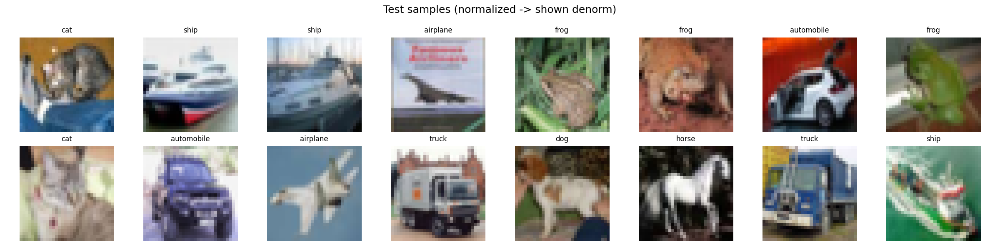
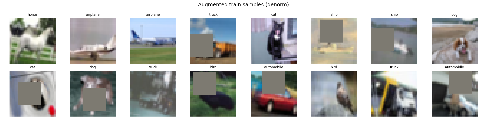
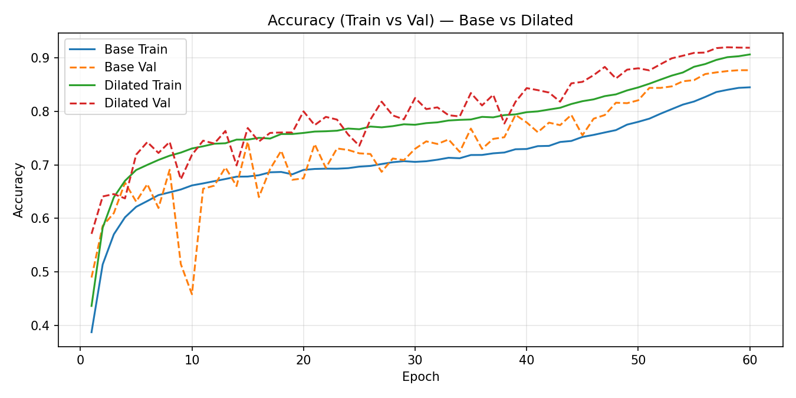
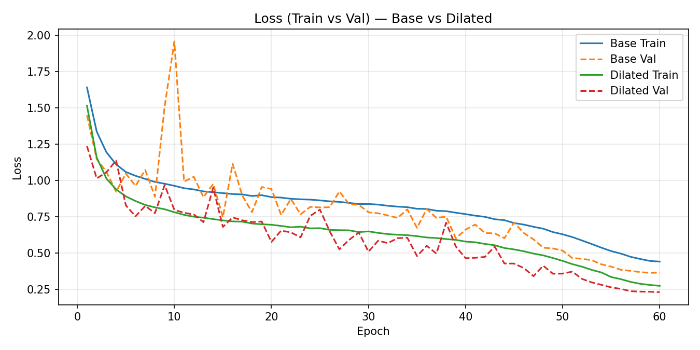
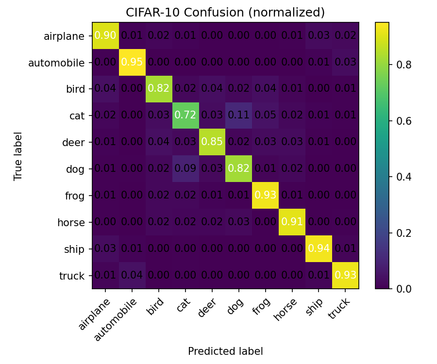
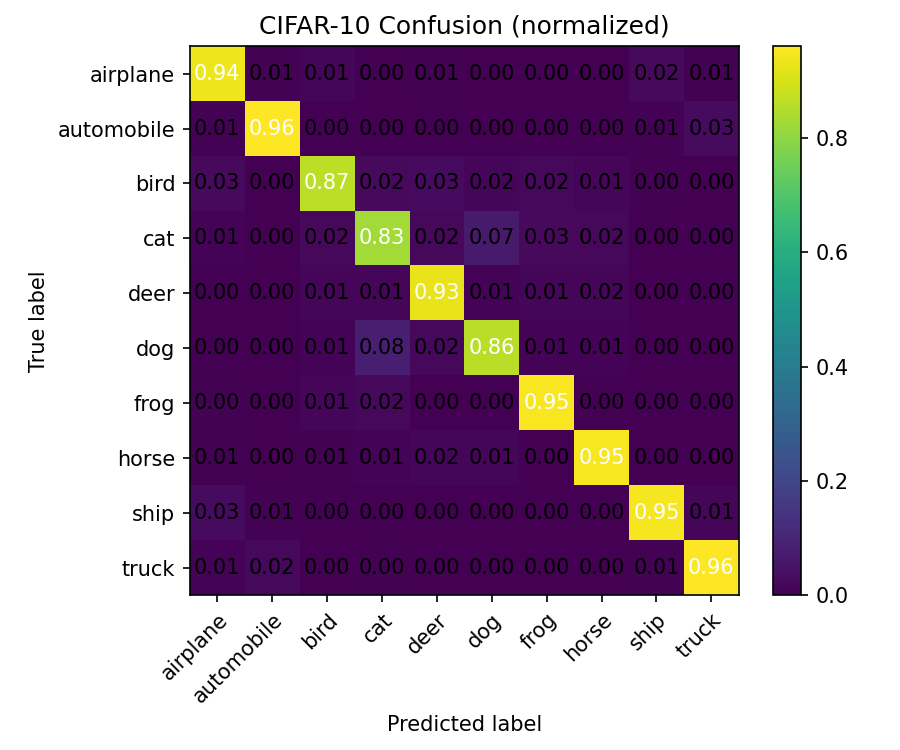

# 🧠 CIFAR-10 — Compact CNNs with DW-Separable + Dilation (No MaxPool)

This repo trains two small CNN variants for CIFAR-10 under strict design rules.

**Design rules**
- No MaxPool; downsampling is done with **exactly three 3×3, stride=2** convolutions *(Net)* or **no downsampling** with **progressive dilation** *(NetDilated)*.  
- Use **Depthwise-Separable** convolutions (not in block 1).  
- Include **one dilated conv** in the final block *(Net)*; **multiple increasing dilations** in *(NetDilated)*.  
- **GAP** head → **Linear(10)** for class logits.  
- **Albumentations** pipeline: HorizontalFlip, ShiftScaleRotate, CoarseDropout (on-the-fly).

**Model variants**
- **Net (C1-C4-O):** three 3×3 / stride = 2 downsamples, DW-Separable later blocks, final dilated conv.  
  Small (~66 k params), RF > 44 at the head.
- **NetDilated:** all stride = 1; RF grown via dilations (e.g., 2 → 4 → 8) with DW-Separable in later blocks.

**Goal**
- ≥ 85 % test accuracy with < 200 k params (these models are well under the budget).

**Nice touches**
- Auto-computed **receptive-field tables** from the real model graph (see RF section).  
- Per-model results saved under `results/base_model/...` and `results/dilated_model/...`.

---

## 2️⃣ Quickstart

### 2.1 Clone & set up environment
```bash
git clone <YOUR_REPO_URL> week7_ERAV4_CIFAR_10_Model_Experiments
cd week7_ERAV4_CIFAR_10_Model_Experiments

python -m venv .venv && source .venv/bin/activate      # Linux/Mac
# or
# .\.venv\Scripts\Activate.ps1                         # Windows PowerShell

pip install -r requirements.txt
```

### 2.2 Train from scratch
#### Base model (Net)
```bash
python train.py --model basic --epochs 25
```
#### Dilated model (NetDilated)
```bash
python train.py --model dilated --epochs 25
```
#### Common overrides
```bash
python train.py --model basic --epochs 25 --batch-size 64 --lr 0.05 --device auto --workers 4
```
> `--lr` is the OneCycle max_lr (starts at lr/10, ramps up then anneals).

### 2.3 Resume from checkpoint
```bash
python train.py --model basic   --resume results/base_model/checkpoints/last.pth
python train.py --model dilated --resume results/dilated_model/checkpoints/last.pth
```

### 2.4 Key arguments
| Argument | Meaning | Default |
|-----------|----------|---------|
| `--model {basic,dilated}` | choose model variant | `basic` |
| `--epochs` | total epochs | `25` |
| `--batch-size` | training batch size | `128` |
| `--lr` | OneCycle max LR | `0.1` |
| `--device {auto,cpu,cuda}` | device selection | `auto` |
| `--workers` | dataloader workers | `2` |
| `--resume PATH` | resume from checkpoint | — |
| `--save-every` | save snapshot every N epochs | `0` |
| `--stats-cache PATH` | CIFAR-10 mean/std cache | `results/cifar10_stats.json` |
| `--recompute-stats` | force recomputation | flag |

### 2.5 Repository layout
```
week7_ERAV4_CIFAR_10_Model_Experiments/
├─ train.py
├─ model.py
├─ utils/
│  ├─ rf_utils.py
│  └─ rf_autogen.py
├─ dataset/
│  └─ cifar10.py
└─ results/
   ├─ base_model/
   │  ├─ train_log.csv
   │  ├─ model_summary.txt
   │  ├─ classification_report.csv
   │  ├─ plots/
   │  │  ├─ acc_curves.png
   │  │  ├─ loss_curves.png
   │  │  ├─ cm.png
   │  │  ├─ test_samples_grid.png
   │  │  └─ augmented_samples_grid.png
   │  └─ checkpoints/{last.pth,best.pth}
   ├─ dilated_model/     (same structure)
   └─ combined/
      └─ plots/{combined_acc.png, combined_loss.png}
```

---

## 3️⃣ Visual Samples & Augmentations

Below are sample grids generated during training (from any model run).

### 3.1 Test Samples (grid)
Representative images from the **CIFAR-10 test split**, denormalized for visualization.  
> 📁 `results/<model_name>/plots/test_samples_grid.png`

<!-- TEST_SAMPLES_GRID -->
<p><strong>Test Samples (grid)</strong><br></p>
<!-- /TEST_SAMPLES_GRID -->

---

### 3.2 Augmented Training Samples (grid)
Examples of the **training split after Albumentations** transforms applied on-the-fly:  
- HorizontalFlip (p = 0.5)  
- ShiftScaleRotate (±5 % shift, ±10 % scale, ±15° rotate)  
- CoarseDropout (1 hole up to 16×16 px, p = 0.5)

> 📁 `results/<model_name>/plots/augmented_samples_grid.png`

<!-- AUGMENTED_SAMPLES_GRID -->
<p><strong>Augmented Train Samples (grid)</strong><br></p>
<!-- /AUGMENTED_SAMPLES_GRID -->

---

## 4️⃣ Model Architectures

Both models share four convolutional blocks (C1–C4) followed by **Global Average Pooling** and an **FC(10)** head.

---

### 4.1 Base Model – `Net (C1 C2 C3 C4 O)`

**Model Summary**  
📁 `results/base_model/model_summary.txt`

<!-- MODEL_SUMMARY_BASE -->
<details><summary><b>Model summary (Base)</b></summary>

```
Trainable parameters: 84322

==========================================================================================
Layer (type:depth-idx)                   Output Shape              Param #
==========================================================================================
Net                                      [1, 10]                   --
├─ConvBlock: 1-1                         [1, 24, 32, 32]           --
│    └─Conv2d: 2-1                       [1, 24, 32, 32]           648
│    └─BatchNorm2d: 2-2                  [1, 24, 32, 32]           48
│    └─ReLU: 2-3                         [1, 24, 32, 32]           --
├─ConvBlock: 1-2                         [1, 32, 32, 32]           --
│    └─Conv2d: 2-4                       [1, 32, 32, 32]           6,912
│    └─BatchNorm2d: 2-5                  [1, 32, 32, 32]           64
│    └─ReLU: 2-6                         [1, 32, 32, 32]           --
├─ConvBlock: 1-3                         [1, 48, 16, 16]           --
│    └─Conv2d: 2-7                       [1, 48, 16, 16]           13,824
│    └─BatchNorm2d: 2-8                  [1, 48, 16, 16]           96
│    └─ReLU: 2-9                         [1, 48, 16, 16]           --
├─DWSeparable: 1-4                       [1, 64, 16, 16]           --
│    └─Conv2d: 2-10                      [1, 48, 16, 16]           432
│    └─Conv2d: 2-11                      [1, 64, 16, 16]           3,072
│    └─BatchNorm2d: 2-12                 [1, 64, 16, 16]           128
│    └─ReLU: 2-13                        [1, 64, 16, 16]           --
├─DWSeparable: 1-5                       [1, 80, 8, 8]             --
│    └─Conv2d: 2-14                      [1, 64, 8, 8]             576
│    └─Conv2d: 2-15                      [1, 80, 8, 8]             5,120
│    └─BatchNorm2d: 2-16                 [1, 80, 8, 8]             160
│    └─ReLU: 2-17                        [1, 80, 8, 8]             --
├─ConvBlock: 1-6                         [1, 96, 8, 8]             --
│    └─Conv2d: 2-18                      [1, 96, 8, 8]             7,680
│    └─BatchNorm2d: 2-19                 [1, 96, 8, 8]             192
│    └─ReLU: 2-20                        [1, 96, 8, 8]             --
├─DWSeparable: 1-7                       [1, 112, 4, 4]            --
│    └─Conv2d: 2-21                      [1, 96, 4, 4]             864
│    └─Conv2d: 2-22                      [1, 112, 4, 4]            10,752
│    └─BatchNorm2d: 2-23                 [1, 112, 4, 4]            224
│    └─ReLU: 2-24                        [1, 112, 4, 4]            --
├─DWSeparable: 1-8                       [1, 128, 4, 4]            --
│    └─Conv2d: 2-25                      [1, 112, 4, 4]            1,008
│    └─Conv2d: 2-26                      [1, 128, 4, 4]            14,336
│    └─BatchNorm2d: 2-27                 [1, 128, 4, 4]            256
│    └─ReLU: 2-28                        [1, 128, 4, 4]            --
├─ConvBlock: 1-9                         [1, 128, 4, 4]            --
│    └─Conv2d: 2-29                      [1, 128, 4, 4]            16,384
│    └─BatchNorm2d: 2-30                 [1, 128, 4, 4]            256
│    └─ReLU: 2-31                        [1, 128, 4, 4]            --
├─AdaptiveAvgPool2d: 1-10                [1, 128, 1, 1]            --
├─Linear: 1-11                           [1, 10]                   1,290
==========================================================================================
Total params: 84,322
Trainable params: 84,322
Non-trainable params: 0
Total mult-adds (Units.MEGABYTES): 13.73
==========================================================================================
Input size (MB): 0.01
Forward/backward pass size (MB): 1.81
Params size (MB): 0.34
Estimated Total Size (MB): 2.16
==========================================================================================
```
</details>
<!-- /MODEL_SUMMARY_BASE -->

**Receptive Field per Layer — Net**
<!-- RF_NET -->
### Receptive Field per Layer — Net

### RF: Net (32x32 input)

| # | Layer | k | s | d | RF_in | jump_in | RF_out | jump_out |
|---:|:------|:-:|:-:|:-:|-----:|--------:|-------:|---------:|
| 1 | c1a.conv | 3 | 1 | 1 | 1 | 1 | 3 | 1 |
| 2 | c1b.conv | 3 | 1 | 1 | 3 | 1 | 5 | 1 |
| 3 | c1c.conv | 3 | 2 | 1 | 5 | 1 | 7 | 2 |
| 4 | c2a.dw | 3 | 1 | 1 | 7 | 2 | 11 | 2 |
| 5 | c2a.pw | 1 | 1 | 1 | 11 | 2 | 11 | 2 |
| 6 | c2b.dw | 3 | 2 | 1 | 11 | 2 | 15 | 4 |
| 7 | c2b.pw | 1 | 1 | 1 | 15 | 4 | 15 | 4 |
| 8 | c3a.conv | 1 | 1 | 1 | 15 | 4 | 15 | 4 |
| 9 | c3b.dw | 3 | 2 | 1 | 15 | 4 | 23 | 8 |
| 10 | c3b.pw | 1 | 1 | 1 | 23 | 8 | 23 | 8 |
| 11 | c4a.dw | 3 | 1 | 2 | 23 | 8 | 55 | 8 |
| 12 | c4a.pw | 1 | 1 | 1 | 55 | 8 | 55 | 8 |
| 13 | c4b.conv | 1 | 1 | 1 | 55 | 8 | 55 | 8 |

**Final RF:** 55 &nbsp;&nbsp; **Final jump:** 8
<!-- /RF_NET -->

---

### 4.2 Dilated Model – `NetDilated (C1 C2 C3 C4 O)`

**Special Note – Stride-Free Design**  
All layers use `stride = 1`; receptive field grows purely by dilation.   
Dense feature maps → large context visibility without resolution loss.

**Model Summary**  
📁 `results/dilated_model/model_summary.txt`

<!-- MODEL_SUMMARY_DILATED -->
<details><summary><b>Model summary (Dilated)</b></summary>

```
Trainable parameters: 197858

==========================================================================================
Layer (type:depth-idx)                   Output Shape              Param #
==========================================================================================
NetDilated                               [1, 10]                   --
├─ConvBlock: 1-1                         [1, 24, 32, 32]           --
│    └─Conv2d: 2-1                       [1, 24, 32, 32]           648
│    └─BatchNorm2d: 2-2                  [1, 24, 32, 32]           48
│    └─ReLU: 2-3                         [1, 24, 32, 32]           --
├─ConvBlock: 1-2                         [1, 32, 32, 32]           --
│    └─Conv2d: 2-4                       [1, 32, 32, 32]           6,912
│    └─BatchNorm2d: 2-5                  [1, 32, 32, 32]           64
│    └─ReLU: 2-6                         [1, 32, 32, 32]           --
├─DWSeparable: 1-3                       [1, 48, 32, 32]           --
│    └─Conv2d: 2-7                       [1, 32, 32, 32]           288
│    └─Conv2d: 2-8                       [1, 48, 32, 32]           1,536
│    └─BatchNorm2d: 2-9                  [1, 48, 32, 32]           96
│    └─ReLU: 2-10                        [1, 48, 32, 32]           --
├─ConvBlock: 1-4                         [1, 48, 32, 32]           --
│    └─Conv2d: 2-11                      [1, 48, 32, 32]           2,304
│    └─BatchNorm2d: 2-12                 [1, 48, 32, 32]           96
│    └─ReLU: 2-13                        [1, 48, 32, 32]           --
├─ConvBlock: 1-5                         [1, 64, 32, 32]           --
│    └─Conv2d: 2-14                      [1, 64, 32, 32]           27,648
│    └─BatchNorm2d: 2-15                 [1, 64, 32, 32]           128
│    └─ReLU: 2-16                        [1, 64, 32, 32]           --
├─ConvBlock: 1-6                         [1, 80, 32, 32]           --
│    └─Conv2d: 2-17                      [1, 80, 32, 32]           5,120
│    └─BatchNorm2d: 2-18                 [1, 80, 32, 32]           160
│    └─ReLU: 2-19                        [1, 80, 32, 32]           --
├─ConvBlock: 1-7                         [1, 80, 32, 32]           --
│    └─Conv2d: 2-20                      [1, 80, 32, 32]           57,600
│    └─BatchNorm2d: 2-21                 [1, 80, 32, 32]           160
│    └─ReLU: 2-22                        [1, 80, 32, 32]           --
├─ConvBlock: 1-8                         [1, 96, 32, 32]           --
│    └─Conv2d: 2-23                      [1, 96, 32, 32]           69,120
│    └─BatchNorm2d: 2-24                 [1, 96, 32, 32]           192
│    └─ReLU: 2-25                        [1, 96, 32, 32]           --
├─DWSeparable: 1-9                       [1, 112, 32, 32]          --
│    └─Conv2d: 2-26                      [1, 96, 32, 32]           864
│    └─Conv2d: 2-27                      [1, 112, 32, 32]          10,752
│    └─BatchNorm2d: 2-28                 [1, 112, 32, 32]          224
│    └─ReLU: 2-29                        [1, 112, 32, 32]          --
├─ConvBlock: 1-10                        [1, 112, 32, 32]          --
│    └─Conv2d: 2-30                      [1, 112, 32, 32]          12,544
│    └─BatchNorm2d: 2-31                 [1, 112, 32, 32]          224
│    └─ReLU: 2-32                        [1, 112, 32, 32]          --
├─AdaptiveAvgPool2d: 1-11                [1, 112, 1, 1]            --
├─Linear: 1-12                           [1, 10]                   1,130
==========================================================================================
Total params: 197,858
Trainable params: 197,858
Non-trainable params: 0
Total mult-adds (Units.MEGABYTES): 200.03
==========================================================================================
Input size (MB): 0.01
Forward/backward pass size (MB): 12.45
Params size (MB): 0.79
Estimated Total Size (MB): 13.26
==========================================================================================
```
</details>
<!-- /MODEL_SUMMARY_DILATED -->

**Receptive Field per Layer — NetDilated**
<!-- RF_DILATED -->
### Receptive Field per Layer — NetDilated

### RF: NetDilated (32x32 input)

| # | Layer | k | s | d | RF_in | jump_in | RF_out | jump_out |
|---:|:------|:-:|:-:|:-:|-----:|--------:|-------:|---------:|
| 1 | c1a.conv | 3 | 1 | 1 | 1 | 1 | 3 | 1 |
| 2 | c1b.conv | 3 | 1 | 1 | 3 | 1 | 5 | 1 |
| 3 | c2a_dw.dw | 3 | 1 | 2 | 5 | 1 | 9 | 1 |
| 4 | c2a_dw.pw | 1 | 1 | 1 | 9 | 1 | 9 | 1 |
| 5 | c2b_pw.conv | 1 | 1 | 1 | 9 | 1 | 9 | 1 |
| 6 | c2c.conv | 3 | 1 | 2 | 9 | 1 | 13 | 1 |
| 7 | c3a_pw.conv | 1 | 1 | 1 | 13 | 1 | 13 | 1 |
| 8 | c3b.conv | 3 | 1 | 4 | 13 | 1 | 21 | 1 |
| 9 | c3c.conv | 3 | 1 | 4 | 21 | 1 | 29 | 1 |
| 10 | c4a.dw | 3 | 1 | 8 | 29 | 1 | 45 | 1 |
| 11 | c4a.pw | 1 | 1 | 1 | 45 | 1 | 45 | 1 |
| 12 | c4b_pw.conv | 1 | 1 | 1 | 45 | 1 | 45 | 1 |

**Final RF:** 45 &nbsp;&nbsp; **Final jump:** 1
<!-- /RF_DILATED -->

---

## 5️⃣ Combined Results & Analysis

### 5.1 Summary Table
<!-- COMBINED_SUMMARY_TABLE -->
| exp_name | params | best_test_acc | best_epoch | final_test_acc | epochs | train_time_sec | augment | optimizer | lr | use_steplr |
|---|---|---|---|---|---|---|---|---|---|---|
| base_model | 84322 | 87.71 | 59 | 87.71 | 60 | N/A | True | SGD | 0.1 | False |
| dilated_model | 197858 | 92.0 | 58 | 91.91 | 60 | N/A | True | SGD | 0.1 | False |
<!-- /COMBINED_SUMMARY_TABLE -->

### 5.2 Accuracy — Train vs Validation (both models)
<!-- COMBINED_ACC_PLOT -->
<p><strong>Accuracy — Base vs Dilated</strong><br></p>
<!-- /COMBINED_ACC_PLOT -->

### 5.3 Loss — Train vs Validation (both models)
<!-- COMBINED_LOSS_PLOT -->
<p><strong>Loss — Base vs Dilated</strong><br></p>
<!-- /COMBINED_LOSS_PLOT -->

---

## 6️⃣ Individual Model Results

### 6.1 Base Model — `Net`
<!-- CM_BASE -->
<p><strong>Confusion Matrix — Base</strong><br></p>
<!-- /CM_BASE -->
<!-- CLS_REPORT_BASE -->
| avg | precision | recall | f1 |
|---|---|---|---|
| macro avg | 0.876 | 0.877 | 0.876 |
| weighted avg | 0.876 | 0.877 | 0.876 |
<!-- /CLS_REPORT_BASE -->

### 6.2 Dilated Model — `NetDilated`
<!-- CM_DILATED -->
<p><strong>Confusion Matrix — Dilated</strong><br></p>
<!-- /CM_DILATED -->
<!-- CLS_REPORT_DILATED -->
| avg | precision | recall | f1 |
|---|---|---|---|
| macro avg | 0.919 | 0.919 | 0.919 |
| weighted avg | 0.919 | 0.919 | 0.919 |
<!-- /CLS_REPORT_DILATED -->

---

## 7️⃣ Conclusion
Both CNNs achieve strong accuracy (≥ 85 %) within a < 200 k parameter budget.  
Base model converges faster due to stride-based downsamples.  
Dilated model preserves spatial resolution and may generalize better (smaller train-val gap).  
DW-Separable + Dilation give large RF at minimal parameter cost.  

---

## 8️⃣ Visualizing Albumentations Pipeline

`visualize_augmentations.py` lets you preview CIFAR-10 augmentations.

```bash
python visualize_augmentations.py --data ./data --n-samples 16
```

Example output → `results/augmentations/augmented_grid.png`

---

## 9️⃣ Updating the README (Automatic Integration)

Run once to fill all sections automatically:

```bash
python update_readme.py

# (optional) recompute RFs
python update_readme.py \
  --rf model.py:Net:"RF: Net (32x32 input)" \
  --rf model.py:NetDilated:"RF: NetDilated (32x32 input)" \
  --rf-input 3 32 32 \
  --rf-ctor num_classes=10
```
