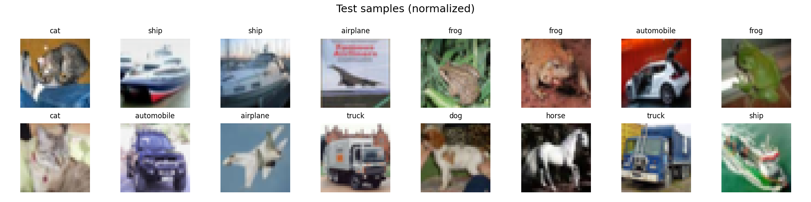
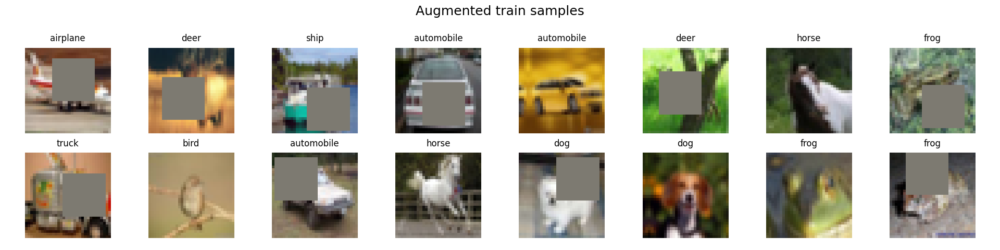

# CIFAR-10: C1C2C3C4O (No MaxPool, 3× 3×3 stride-2), DW-Separable & Dilated

This repo trains a compact CNN on CIFAR-10 with the following constraints:
- **No MaxPooling** (we use exactly three `3×3, stride=2` layers to downsample).
- One or more **Depthwise Separable Convs** (not in block 1).
- One **Dilated Conv** in the last block.
- **GAP** (Global Average Pooling). A final FC after GAP is used to get logits for 10 classes.
- **On-the-fly augmentation** via Albumentations: HorizontalFlip, ShiftScaleRotate, CoarseDropout.
- Target: **≥85%** test accuracy, **<200k** params (this model is ~66k).

## Quickstart

```bash
python -m venv .venv && source .venv/bin/activate  # (Linux/Mac)
pip install -r requirements.txt

python train.py --epochs 25 --batch-size 128 --lr 0.001 --device auto
```

Training artifacts go to `results/` (CSV log and plots). Run `update_readme.py` to inject latest results into this README.

## Receptive Field (RF) running tally

We track RF using: `RF_out = RF_in + (k-1)*d*jump`, `jump_out = jump_in * stride` (start RF=1, jump=1).

The model’s main spatial ops and cumulative RF:
- B1a: `3×3 s1 d1` → RF=3, jump=1  
- B1b: `3×3 s1 d1` → RF=5, jump=1  
- B1c: `3×3 s2 d1` → RF=7, jump=2  ← **(1st downsample)**
- B2a: `DW 3×3 s1 d1` → RF=11, jump=2  
- B2b: `PW 1×1 s1` → RF=11, jump=2  
- B2c: `DW 3×3 s2 d1` → RF=15, jump=4  ← **(2nd downsample)**
- B2d: `PW 1×1 s1` → RF=15, jump=4  
- B3a: `PW 1×1 s1` → RF=15, jump=4  
- B3b: `DW 3×3 s2 d1` → RF=23, jump=8  ← **(3rd downsample)**
- B3c: `PW 1×1 s1` → RF=23, jump=8  
- B4a: `DW 3×3 s1 d2` → RF=55, jump=8  ← **(dilated; RF > 44)**
- B4b: `PW 1×1 s1` → RF=55, jump=8  

After B4, the feature map is 4×4 (from 32→16→8→4), then **GAP** → 1×1, and a small FC → 10 classes.

> Why can FC after GAP be “optional”? In many modern CNNs, GAP is followed by a **linear classifier** (1×1 conv or FC) to map channels→classes. Strictly speaking, if the last conv already outputs `C=10` channels, you can compute logits by **GAP alone**. In practice, we keep a tiny linear layer after GAP for flexibility.


**Latest Test Accuracy:** 59.80% at epoch 2


**Latest Test Accuracy:** 59.80% at epoch 2

<!-- RESULTS -->
| Metric | Value |
|---|---:|
| **Best Test Acc** | **59.80%** (epoch 2) |
| Best Test Loss | 1.0959 |
| Last Train Acc | 53.74% (epoch 2) |
| Last Train Loss | 1.2765 |
| Updated | 2025-10-04 16:12:04 |
<!-- /RESULTS -->

<!-- PLOTS -->
<p><strong>Test samples</strong><br>
</p>

<p><strong>Augmented train samples</strong><br>
</p>

<p><strong>Accuracy curves</strong><br>
</p>
<!-- /PLOTS -->
