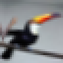
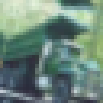

# CIFAR-10: C1C2C3C4O (No MaxPool, 3× 3×3 stride-2), DW-Separable & Dilated

This repo trains a compact CNN on CIFAR-10 with the following constraints:
- **No MaxPooling** (we use exactly three `3×3, stride=2` layers to downsample).
- One or more **Depthwise Separable Convs** (not in block 1).
- One **Dilated Conv** in the last block.
- **GAP** (Global Average Pooling). A final FC after GAP is used to get logits for 10 classes.
- **On-the-fly augmentation** via Albumentations: HorizontalFlip, ShiftScaleRotate, CoarseDropout.
- Target: **≥85%** test accuracy, **<200k** params (this model is ~66k).

## Quickstart

```bash
python -m venv .venv && source .venv/bin/activate  # (Linux/Mac)
pip install -r requirements.txt

python train.py --epochs 25 --batch-size 128 --lr 0.001 --device auto
```

Training artifacts go to `results/` (CSV log and plots). Run `update_readme.py` to inject latest results into this README.

## Receptive Field (RF) running tally

We track RF using: `RF_out = RF_in + (k-1)*d*jump`, `jump_out = jump_in * stride` (start RF=1, jump=1).

The model’s main spatial ops and cumulative RF:
- B1a: `3×3 s1 d1` → RF=3, jump=1  
- B1b: `3×3 s1 d1` → RF=5, jump=1  
- B1c: `3×3 s2 d1` → RF=7, jump=2  ← **(1st downsample)**
- B2a: `DW 3×3 s1 d1` → RF=11, jump=2  
- B2b: `PW 1×1 s1` → RF=11, jump=2  
- B2c: `DW 3×3 s2 d1` → RF=15, jump=4  ← **(2nd downsample)**
- B2d: `PW 1×1 s1` → RF=15, jump=4  
- B3a: `PW 1×1 s1` → RF=15, jump=4  
- B3b: `DW 3×3 s2 d1` → RF=23, jump=8  ← **(3rd downsample)**
- B3c: `PW 1×1 s1` → RF=23, jump=8  
- B4a: `DW 3×3 s1 d2` → RF=55, jump=8  ← **(dilated; RF > 44)**
- B4b: `PW 1×1 s1` → RF=55, jump=8  

After B4, the feature map is 4×4 (from 32→16→8→4), then **GAP** → 1×1, and a small FC → 10 classes.

> Why can FC after GAP be “optional”? In many modern CNNs, GAP is followed by a **linear classifier** (1×1 conv or FC) to map channels→classes. Strictly speaking, if the last conv already outputs `C=10` channels, you can compute logits by **GAP alone**. In practice, we keep a tiny linear layer after GAP for flexibility.


**Latest Test Accuracy:** 59.80% at epoch 2


**Latest Test Accuracy:** 59.80% at epoch 2

<!-- RESULTS -->
| Metric | Value |
|---|---:|
| **Best Test Acc** | **92.62%** (epoch 39) |
| Best Test Loss | 0.2218 |
| Last Train Acc | 91.83% (epoch 40) |
| Last Train Loss | 0.2390 |
| Updated | 2025-10-04 20:25:27 |
<!-- /RESULTS -->

<!-- PLOTS -->
<p><strong>Test samples (grid)</strong><br>
</p>

<p><strong>Augmented train samples (grid)</strong><br>
</p>

<p><strong>Accuracy curves</strong><br>
</p>

<p><strong>Loss curves</strong><br>
</p>

<p><strong>Confusion matrix (normalized)</strong><br>
</p>
<!-- /PLOTS -->

<!-- TILE_GALLERY -->
<h4>Test sample tiles</h4>
<p>


</p>

<h4>Augmented sample tiles</h4>
<p>






</p>
<!-- /TILE_GALLERY -->

<!-- VISUALIZATION -->
**Augmentation Visualization**

Use the helper to render a crisp grid and per-image tiles (nearest-neighbor, no blur):

```bash
python visualize_augmentations.py --save results/plots/aug_demo.png
```
_Why_: sanity-check your Albumentations pipeline and confirm computed mean/std are used.
<!-- /VISUALIZATION -->

<!-- MODEL_SUMMARY -->
<details><summary><b>Model summary (click to expand)</b></summary>

```
Trainable parameters: 290474

==========================================================================================
Layer (type:depth-idx)                   Output Shape              Param #
==========================================================================================
NetDilated                               [1, 10]                   --
├─ConvBlock: 1-1                         [1, 32, 32, 32]           --
│    └─Conv2d: 2-1                       [1, 32, 32, 32]           864
│    └─BatchNorm2d: 2-2                  [1, 32, 32, 32]           64
│    └─ReLU: 2-3                         [1, 32, 32, 32]           --
├─ConvBlock: 1-2                         [1, 48, 32, 32]           --
│    └─Conv2d: 2-4                       [1, 48, 32, 32]           13,824
│    └─BatchNorm2d: 2-5                  [1, 48, 32, 32]           96
│    └─ReLU: 2-6                         [1, 48, 32, 32]           --
├─DWSeparable: 1-3                       [1, 64, 32, 32]           --
│    └─Conv2d: 2-7                       [1, 48, 32, 32]           432
│    └─Conv2d: 2-8                       [1, 64, 32, 32]           3,072
│    └─BatchNorm2d: 2-9                  [1, 64, 32, 32]           128
│    └─ReLU: 2-10                        [1, 64, 32, 32]           --
├─ConvBlock: 1-4                         [1, 64, 32, 32]           --
│    └─Conv2d: 2-11                      [1, 64, 32, 32]           4,096
│    └─BatchNorm2d: 2-12                 [1, 64, 32, 32]           128
│    └─ReLU: 2-13                        [1, 64, 32, 32]           --
├─ConvBlock: 1-5                         [1, 80, 32, 32]           --
│    └─Conv2d: 2-14                      [1, 80, 32, 32]           46,080
│    └─BatchNorm2d: 2-15                 [1, 80, 32, 32]           160
│    └─ReLU: 2-16                        [1, 80, 32, 32]           --
├─ConvBlock: 1-6                         [1, 96, 32, 32]           --
│    └─Conv2d: 2-17                      [1, 96, 32, 32]           7,680
│    └─BatchNorm2d: 2-18                 [1, 96, 32, 32]           192
│    └─ReLU: 2-19                        [1, 96, 32, 32]           --
├─ConvBlock: 1-7                         [1, 96, 32, 32]           --
│    └─Conv2d: 2-20                      [1, 96, 32, 32]           82,944
│    └─BatchNorm2d: 2-21                 [1, 96, 32, 32]           192
│    └─ReLU: 2-22                        [1, 96, 32, 32]           --
├─ConvBlock: 1-8                         [1, 112, 32, 32]          --
│    └─Conv2d: 2-23                      [1, 112, 32, 32]          96,768
│    └─BatchNorm2d: 2-24                 [1, 112, 32, 32]          224
│    └─ReLU: 2-25                        [1, 112, 32, 32]          --
├─DWSeparable: 1-9                       [1, 128, 32, 32]          --
│    └─Conv2d: 2-26                      [1, 112, 32, 32]          1,008
│    └─Conv2d: 2-27                      [1, 128, 32, 32]          14,336
│    └─BatchNorm2d: 2-28                 [1, 128, 32, 32]          256
│    └─ReLU: 2-29                        [1, 128, 32, 32]          --
├─ConvBlock: 1-10                        [1, 128, 32, 32]          --
│    └─Conv2d: 2-30                      [1, 128, 32, 32]          16,384
│    └─BatchNorm2d: 2-31                 [1, 128, 32, 32]          256
│    └─ReLU: 2-32                        [1, 128, 32, 32]          --
├─AdaptiveAvgPool2d: 1-11                [1, 128, 1, 1]            --
├─Linear: 1-12                           [1, 10]                   1,290
==========================================================================================
Total params: 290,474
Trainable params: 290,474
Non-trainable params: 0
Total mult-adds (Units.MEGABYTES): 294.39
==========================================================================================
Input size (MB): 0.01
Forward/backward pass size (MB): 15.20
Params size (MB): 1.16
Estimated Total Size (MB): 16.38
==========================================================================================
```

</details>
<!-- /MODEL_SUMMARY -->

<!-- RF -->
### RF: Net (32x32 input)

| # | Layer | k | s | d | RF_in | jump_in | RF_out | jump_out |
|---:|:------|:-:|:-:|:-:|-----:|--------:|-------:|---------:|
| 1 | c1a.conv | 3 | 1 | 1 | 1 | 1 | 3 | 1 |
| 2 | c1b.conv | 3 | 1 | 1 | 3 | 1 | 5 | 1 |
| 3 | c1c.conv | 3 | 2 | 1 | 5 | 1 | 7 | 2 |
| 4 | c2a.dw | 3 | 1 | 1 | 7 | 2 | 11 | 2 |
| 5 | c2a.pw | 1 | 1 | 1 | 11 | 2 | 11 | 2 |
| 6 | c2b.dw | 3 | 2 | 1 | 11 | 2 | 15 | 4 |
| 7 | c2b.pw | 1 | 1 | 1 | 15 | 4 | 15 | 4 |
| 8 | c3a.conv | 1 | 1 | 1 | 15 | 4 | 15 | 4 |
| 9 | c3b.dw | 3 | 2 | 1 | 15 | 4 | 23 | 8 |
| 10 | c3b.pw | 1 | 1 | 1 | 23 | 8 | 23 | 8 |
| 11 | c4a.dw | 3 | 1 | 2 | 23 | 8 | 55 | 8 |
| 12 | c4a.pw | 1 | 1 | 1 | 55 | 8 | 55 | 8 |
| 13 | c4b.conv | 1 | 1 | 1 | 55 | 8 | 55 | 8 |

**Final RF:** 55 &nbsp;&nbsp; **Final jump:** 8


### RF: NetDilated (32x32 input)

| # | Layer | k | s | d | RF_in | jump_in | RF_out | jump_out |
|---:|:------|:-:|:-:|:-:|-----:|--------:|-------:|---------:|
| 1 | c1a.conv | 3 | 1 | 1 | 1 | 1 | 3 | 1 |
| 2 | c1b.conv | 3 | 1 | 1 | 3 | 1 | 5 | 1 |
| 3 | c2a_dw.dw | 3 | 1 | 2 | 5 | 1 | 9 | 1 |
| 4 | c2a_dw.pw | 1 | 1 | 1 | 9 | 1 | 9 | 1 |
| 5 | c2b_pw.conv | 1 | 1 | 1 | 9 | 1 | 9 | 1 |
| 6 | c2c.conv | 3 | 1 | 2 | 9 | 1 | 13 | 1 |
| 7 | c3a_pw.conv | 1 | 1 | 1 | 13 | 1 | 13 | 1 |
| 8 | c3b.conv | 3 | 1 | 4 | 13 | 1 | 21 | 1 |
| 9 | c3c.conv | 3 | 1 | 4 | 21 | 1 | 29 | 1 |
| 10 | c4a.dw | 3 | 1 | 8 | 29 | 1 | 45 | 1 |
| 11 | c4a.pw | 1 | 1 | 1 | 45 | 1 | 45 | 1 |
| 12 | c4b_pw.conv | 1 | 1 | 1 | 45 | 1 | 45 | 1 |

**Final RF:** 45 &nbsp;&nbsp; **Final jump:** 1
<!-- /RF -->
